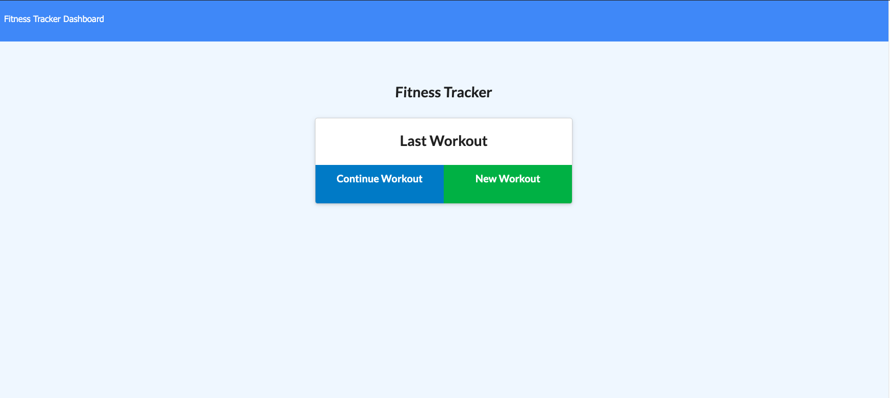
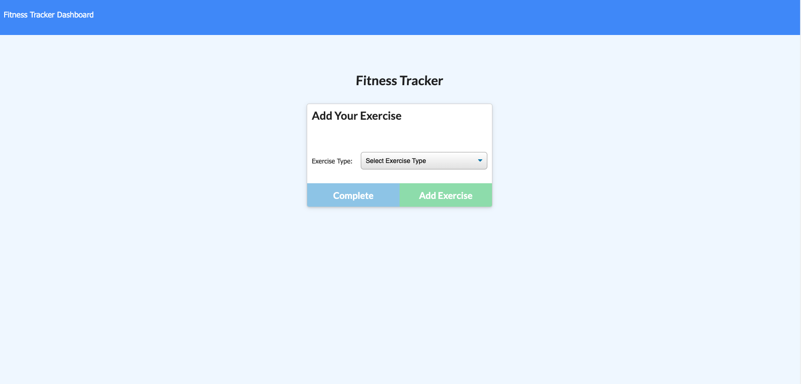

# Unit 17 Nosql Homework: Workout Tracker

## Summary

This project emphasizes the use of MongoDB, mongoose, morgan, and express, to dynamically update a fitness tracking app

## Business Context

A consumer will reach their fitness goals more quickly when they track their workout progress.

## App Features
This is a Workout Tracker using a Nosql database. When the user loads the page, they should be given the option to create a new workout, or continue with their last workout.

The user should be able to:

* Add exercises to a previous workout plan.

* Add new exercises to a new workout plan.

* View multiple the combined weight of multiple exercises on the stats page.

## App URLs

* The URL to the deployed application: [Heroku](https://pacific-chamber-31516.herokuapp.com/)

* The URL to the GitHub repository: [fitness-tracker](https://github.com/yarvelo23/fitness-tracker)
